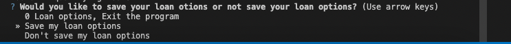

README FILE
# Loan Qualifier Challenge

"Just after the title, introduce your project by describing attractively what the project is about and what is the main problem that inspires you to create this project or what is the main contribution for the potential user of your project."

The project is to determine if the user quialifies for various loans. The user has to imput their current credit score, monthly debts, monthly income,desired loan amount and their home value. The exsisting daily rate sheet file will compare the user provided information with the exsisting loans and determine if the user qualifies for one or multiple. once the calculatios have run then code will display 3 options the user can pick from them. 
When shown with no valid loan options prompt the user to save
When the user has options the first option will be save the file
When the user has options the second option will be to not save the file 

Using this program the user can determine if they are eligable for a or multiple loans. Having options can provide a better deal for our user rather than just going to their bank and accepting the first loan provided to them.

---

## Technologies

"Describe the technologies required to use your project such as programming languages, libraries, frameworks, and operating systems. Be sure to include the specific versions of any critical dependencies that you have used in the stable version of your project."

This code was created with Python 3.9

---

## Installation Guide

"In this section, you should include detailed installation notes containing code blocks and screenshots."

pip install (Orage Word)

* [fire](https://github.com/google/python-fire) - For the command line interface, help page, and entrypoint.

* [questionary](https://github.com/tmbo/questionary) - For interactive user prompts and dialogs
* [sys](https://pypi.org/project/os-sys/) - For better operating and interpreting as it provides access to the variables and functions that can be manipulated

---

## Usage

This section should include screenshots, code blocks, or animations explaining how to use your project.

Welcome to the Loan Qualifier program!

To being using this program you will run the code and this will load the daily rates in for you fro '../Assignment_2_loan/data/daily_rate_sheet.csv' 

Now that you have the latest daily rates you can begin answering some basic loan application questions. 

The applicantn has to provide answers for the following questions:
What's your credit score? ____
^credit_score.py understands user Credit score

What's your current amount of monthly debt? ____
What's your total monthly income? ____
^will calculate debt_to_income.py

What's your desired loan amount? ____
^with debt_to_income.py and laon_to_value.py the desired loan amount is calculated to be eligable or not
What's your home value? ____

These quesitons are pulled from filter folder in our code. These Modules each interpret the data provided by the user and calculate if the user is eligable for any of the loans available. 

After the questions are answered the program spits out a number of loan options available. From here the user is prompted to answer a few quesitons.

Code for the questionary shows the following options to pick from

0 Loan options, Exit the program
    this option kicks the user out of the program and back to the terminal

Save my loan options
    This options next asks the user to enter a file name for their loan options. Once the user enters and file name the file is saved. 

    Here the user is prompted to give their loan file a name

Don't save my loan options
    The program kicks the user without saving any new file. 
 - code of the questions above in if else statement for CLI

The CLI will look like this when the person is asked to decide what to do with their loan options (see screenshot)

If the user decides to save their options, they will get promtped to enter a file name.

---

## Contributors

In this section, list all the people who contribute to this project. You might want recruiters or potential collaborators to reach you, so include your contact email and, optionally, your LinkedIn or Twitter profile.

Ben Harrington

---

## License

When you share a project on a repository, especially a public one, it's important to choose the right license to specify what others can and can't with your source code and files. Use this section to include the license you want to use.

MIT